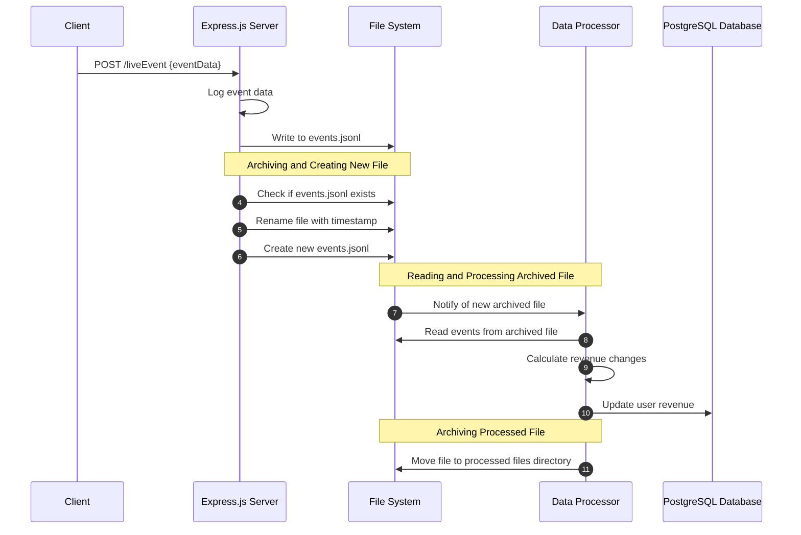

# Event Processing System

This is a Node.js application that consists of a server that receives events from a client and a data processor that reads the events and updates a database accordingly.

## Setup & Running

1. **Clone the repository to your local machine.**

    ```sh
    git clone https://github.com/amirguterman/event-processing-system.git
    ```

2. **Navigate to the project directory.**

    ```sh
    cd event-processing-system
    ```

3. **Install the necessary dependencies by running:**

    ```sh
    npm install
    ```

4. **Setup the database by running the SQL commands located in the provided SQL file.** 

    ```sh
    psql -h localhost -U postgres -d postgres -f create_table.sql
    ```

   **Note:** The password for the postgres user is `password1!`. You may need to input this password during the execution of the above command.

5. **Update the database connection configurations in `server.js`, `client.js` and `data_processor.js` if needed.**

6. **Start the application**

    ```sh
    npm start
    ```

The application will now be running, with the server accepting events at the `/liveEvent` endpoint, the client reading and sending events to the server, and the data processor updating the user revenue data in the database.

## How the System Works

### Server
The server, implemented in Express.js, listens to incoming POST requests at the /liveEvent endpoint. Upon receiving an event, the server logs the event data to a events.jsonl file. The server also provides a GET endpoint, /userEvents/:userId, which fetches the revenue for a specific user from the PostgreSQL database.

The server is also responsible for file management. Every minute, it checks if the events.jsonl file exists. If it does, the server renames the file by adding a timestamp, thereby archiving the file and creating a new events.jsonl file for upcoming events. This process is atomic to ensure that there's no situation where event files are not archived before they are processed in the database, as well as not to process them twice in cases where the application terminates between these operations.

### Client
The client module is responsible for sending events to the server. It reads the events from the events.jsonl file and sends each event to the /liveEvent endpoint. Once the events are sent, it generates new test events and appends them to the events.jsonl file. The client module also includes functionality to list user events from the server.

### Data Processor
The data processor is responsible for processing the logged events and updating the user revenue data in the PostgreSQL database accordingly. It reads the events from the timestamped event files, calculates the revenue changes for each user, and updates the database. After processing a file, it moves the file to a separate directory for processed files. The operations of reading, processing, and moving the file are also performed as an atomic operation, ensuring that an event file is processed exactly once even in case of application terminations.

### Sequence Diagram 


## Event Format

The `events.jsonl` file used by the client to send events to the server will be created automatically and should be in the following format:

```json
{"userId": "user1", "name": "add_revenue", "value": 100}
{"userId": "user1", "name": "subtract_revenue", "value": 50}
{"userId": "user2", "name": "add_revenue", "value": 200}
```

Each line is a JSON object representing an event, where:

- `"userId"` is the ID of the user.
- `"name"` is the type of event. For this system, the event type can be either `"add_revenue"` or `"subtract_revenue"`.
- `"value"` is the amount of revenue to be added to or subtracted from the user's total.

Events are separated by newlines (hence the `.jsonl` extension, indicating the file contains JSON Lines text).

## Future Enhancements

This system can be extended in several ways:

1. **Multiple event types:** Currently, the system only supports the "add_revenue" event. It can be extended to support different event types, which would require modifying the client to generate different event types, the server to log different event types, and the data processor to handle different event types.

2. **User authentication:** The system could include user authentication to ensure that only authenticated users can send events. This would require adding authentication middleware to the server.

3. **Real-time updates:** The system could use websockets to provide real-time updates to clients when their revenue data changes. This would require adding a websocket server to the system and modifying the data processor to send updates via this websocket server.

4. **More detailed logging:** The system could log more details about each event, such as the timestamp and the IP address of the client sending the event. This would require modifying the server's logging functionality.

5. **Handling of failed or incomplete events:** The system could be improved to handle scenarios where events fail to be sent or are sent incomplete. This would involve adding error handling and retry logic to the client.
